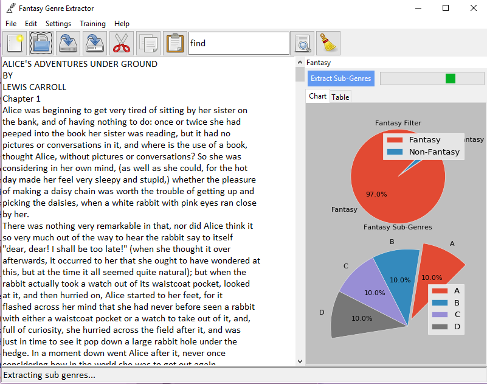

************
**Tutorial**
************

Application On Start-up
--------------------------------
.. figure:: _static/init_mainform.png
   :align:   center

   Initial form on start-up

Setting Up The Corpus
--------------------------------

   Initial

Train The Fantasy Filter
--------------------------------

.. figure:: _static/op_fanfilter.png
   :align:   center

   Open the fantasy filter training form

   Initial fantasy filter training form

Train Sub Genre Classifier
--------------------------------

.. figure:: _static/op_extsub.png
   :align:   center

   Open the fantasy sub extractor training form

.. figure:: _static/init_extsub.png
   :align:   center

   Initial fantasy sub extractor training form

Extract Genres From Text
--------------------------------

   Open text file or copy and paste text into the note pad.

Click "Extract Sub-Genres"

Step 1: Checking main genre
----------------------------

   Initial

Step 2: Extracting main genre
------------------------------
.. figure:: _static/usage3.png
   :align:   center

   Initial

